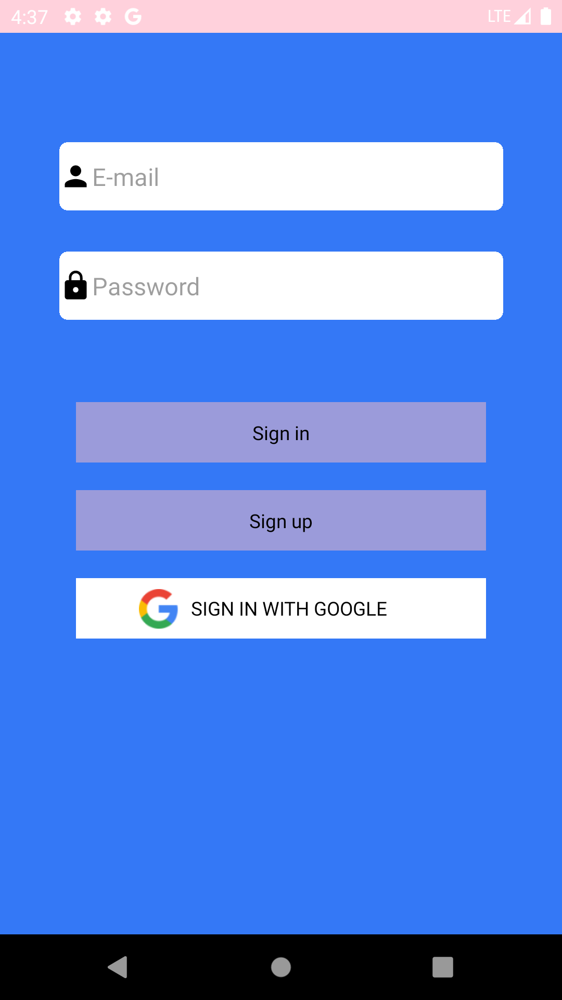
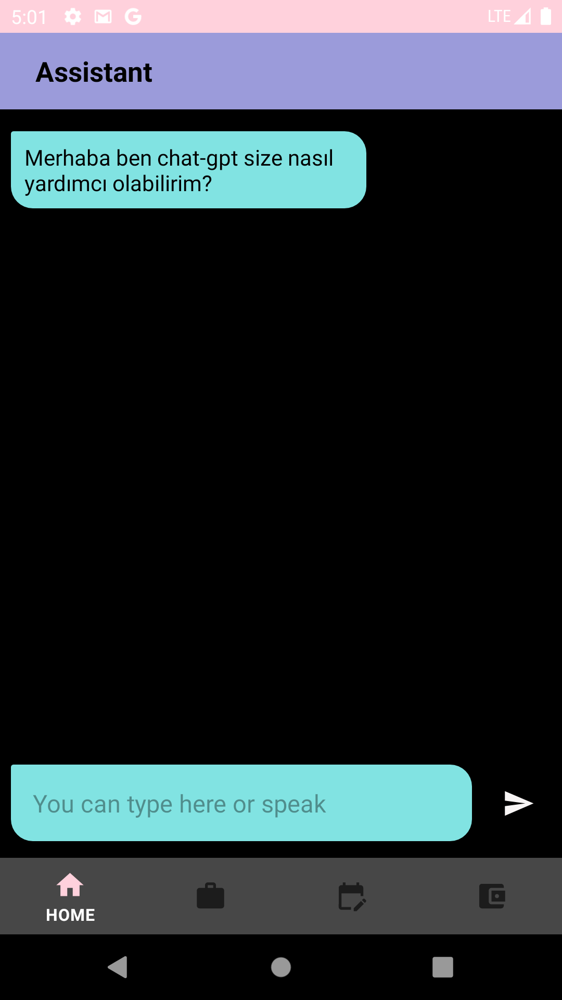
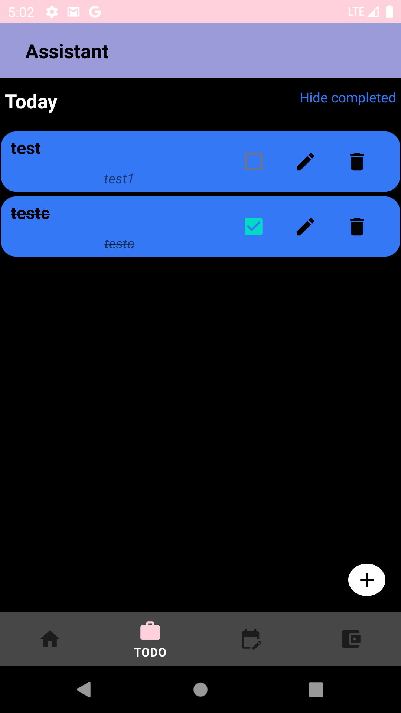
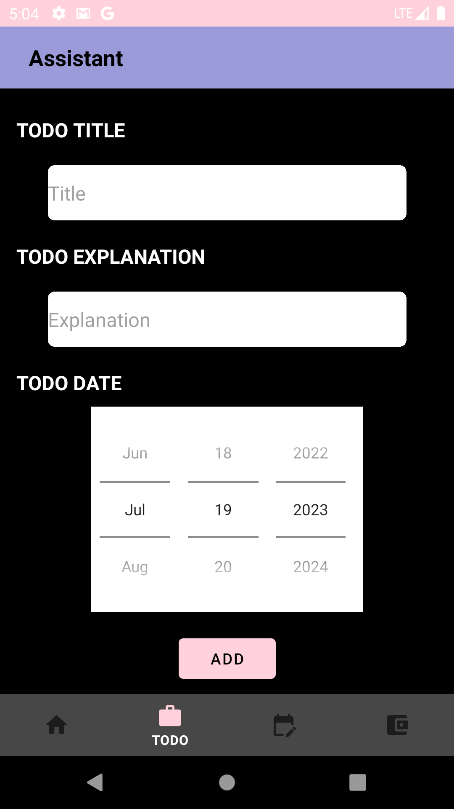
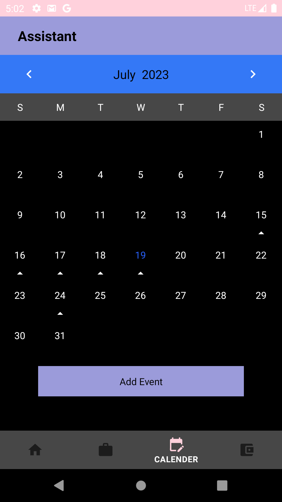
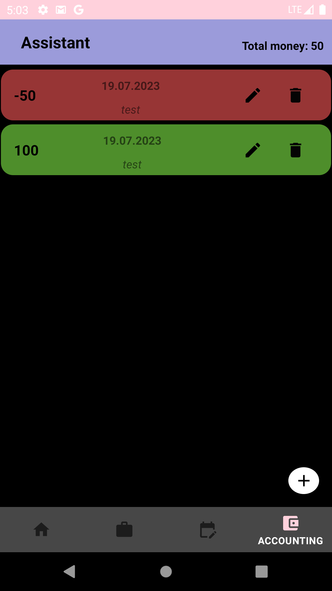
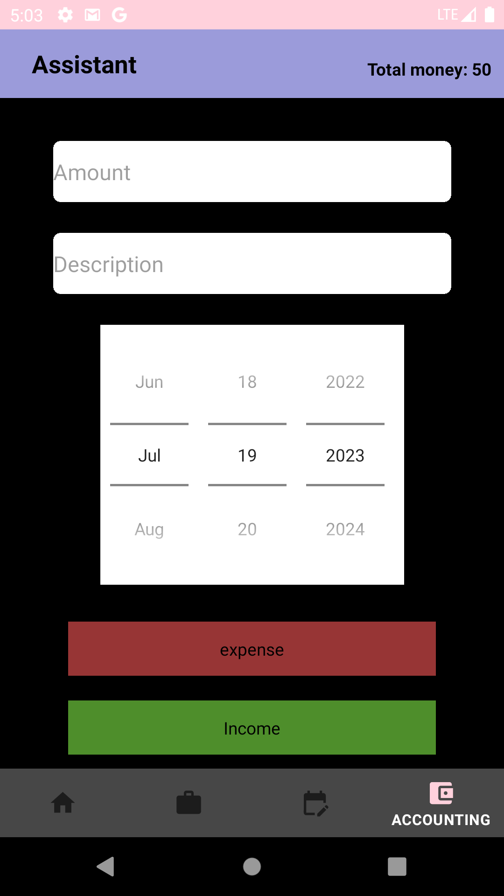

# Asistant

This project was made to note and organize simple daily needs, you can also talk to chatbot to answer any questions that come to your mind.

## Contents of the project

- Todo List
- Accounting
- Chatgpt

  
## Technologies

- Navigation
- Room
- Retrofit
- Hilt
- Lifecycle
- MVVM
- Firebase
- Okhttp
- Custom Calendar

  
## Screenshot

  
  

  
